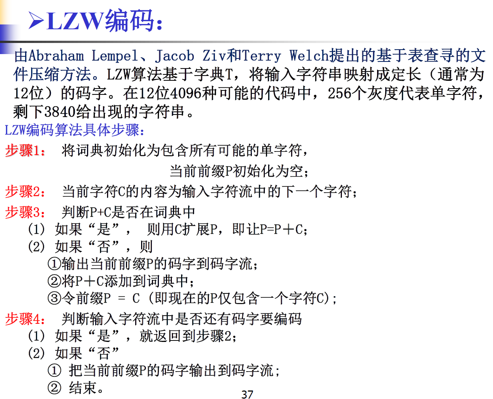

邻域

4邻域

对角4邻域

像素邻域

m邻域（定义比较复杂）

$$
f(p),f(q)\in V\\
\text{or  }q\in N_4(p)\\
\text{or  }q\in N_D(p);\\
且f(N_4(p)\cap N_4(q))\cap V=\empty
$$

## 彩色图像处理

LMS长中短波视锥细胞，分别对RGB敏感

CIE国际照明委员会

CIE 1931 RGB 色彩空间（色域 color space）

CIE 1931 XYZ标准色度系统 

1. 选取新坐标轴，使得所有波长点都在第一卦限
    1. 注意此轴不正交
2. 正交化坐标轴（各颜色点同时变换）
3. 归一化各颜色点亮度至1（将各点投影到x+y+z=1平面，等亮度平面）
    - xyz相互约束，省去z轴（将各点再投影到xOy平面，即色图的xy轴）
    - 色度图（色品图）的边缘为纯色，内部为混合
    - 白点：决定RGB最大亮度组合

色域标准：RGB原色点位置+白点位置

CIE 1931 Yxy色度图，最常见的色图

单色光轨迹线+紫红线=轮廓

黑体轨迹线

tristimulus 三刺激值

https://colorizer.org/

### 色彩模式

- RGB (red,green,blue)
- HSV/HSB (hue,saturation,value/brightness)表示色相、饱和度和明度
    - 色调，色相（H）是色彩的基本属性，就是平常所说的颜色名称，如红色、黄色等。[0, 360)
    - 饱和度（S）是指色彩的纯度，越高色彩越纯 (鲜艳)，低则逐渐变灰，0-100%, 0-255
    - 明度（V），取0-100%, 0-255
    - HSV是**倒锥形**，最粗处明度为1
    - $V=\text{max}(R,G,B)$
- HSI Intensity 亮度
    - H 红色为0度
    - **双锥形**，中间最粗处亮度为0.5
    - I为从黑尖到白底锥轴
    - $I=1/3(R+G+B)$
- HSL/HLS Lightness 
    - 和HSI有点区别
    - 圆柱形（以Chroma为半径，可画成双锥）
    - $L=1/2[\text{max}(R,G,B)+\text{min}(R,G,B)]$
- CMY，CMYK Cyan, Magenta, Yellow 品红（洋红），青，黄
    - CMY=[1,1,1]-[R,G,B]
- YUV (YCrCb) 
    - Y是指亮度分量，Cb指蓝色色度分量(blue chrominance)，而Cr指红色色度分量(red chrominance)
    - 只留Y则是黑白，为了兼容黑白和彩色电视诞生
- Lab (CIE L\*a\*b)

S=0就是灰色，RGB体对角线，圆锥圆柱高

饱和度+明度统称：色调

七大色调：https://en.wikipedia.org/wiki/Tint,_shade_and_tone

1. 纯
2. 明：加白色，S变化
3. 淡：再加白色，饱和度S变化
4. 白色调
5. 灰：纯加黑色，明度变化
6. 暗：再加黑色
7. 黑色调

Brightness 亮度or 明度

亮度和明度的区别是：**明度值是相对1处而言，亮度值是相对0.5处而言。**

由此，两者的颜色模型也不同，HSI是双锥形，中间最粗处亮度为0.5；而HSV是倒锥形，最粗处明度为1

一种纯色的明度等于白色的明度，而纯色的亮度等于中度灰的亮度

圆形三角六边形

- HSV/HSB 为 色相，饱和度，明度 (brightness)
    - 设计师
- HSL 为 色相，饱和度，亮度 (lightness) 
    - 双锥空间，程序员常用

RGB加色模型，发光：显示屏

CMYK减色模型，吸光：打印机

- 黄 Yellow
- 品 Magenta
- 青 Cyan
- 黑 blacK （BK） 

色彩模型：RGB，CMYK，HSV，HSL

色域 Color Gamut：是色彩空间的子集，比如99%sRGB

色彩空间

- Adobe RGB
- DCI-P3
- sRGB
- SWOP CMYK（由大到小）

## 图像压缩

1. 变换编码：通常有损

2. 预测编码：通常无损

jpeg 有损

- 采用YUV，不适合压缩矢量图
- RGB to YCbCr
- DCT
- 量化：人眼对亮度敏感，CbCr采用更大的量化常数（允许更多损失）改压缩比就是在改量化表
- zigzag
- RLE
- Huffman

png 无损

- Filtering
- DEFLATE
    - LZSS (Lempel-Ziv-Storer-Szymanski) zip中也使用
    - Huffman

H.264 AVC Advanced Video  Coding 

- I iFrame
- P Predicted frames
- B Bidirectional Predicted Frames

### 压缩编码

Huffman

Shannon

- 信息论中的Shannon编码只指定编码长度为$l(x)=\lceil \log\frac{1}{p(x)}\rceil$

Fano、Shannon-Fano

- Cover信息论中叫Fano编码，DIP中习惯叫Shannon-Fano
- 按符号出现概率从大到小排，划分成两块概率和最接近的符号集合，递归

Shannon-Fano-(Ellias)

- Cover信息论给出了多个构造办法

算术编码 Arithmetic Coding

游程编码（RLE，Run Length Encoding）：基于字典的技术

L-Z (Lempel-Ziv) 编码

- LZW Lempel-Ziv-Welch
- 处理序列重复

LZSS (Lempel-Ziv-Storer-Szymanski)

- Search Buffer+Look Ahead Buffer=Sliding Window

### 直方图

从左到右黑色，阴影，高光，白色

调色软件可以进行灰度变换（变化强烈的集中在一个区域，使用曲线工具），即在做直方图均衡

1. 直方图均衡化 Equalization

2. 直方图规定化（直方图匹配Matching，Specification）：希望得到直方图非平
    - 方法：将目标和原图都做均衡化，认为均衡结果相同。对原图均衡化结果作用目标图均衡化的反函数

## 图像变换

### DCT

$$
C(u,v)=a(u)b(v)\sum_{x=0}^{N-1}\sum_{y=0}^{M-1}f(x,y)\cos[\frac{2\pi}{N}(2x+1)u]
\cos[\frac{2\pi}{M}(2y+1)v]\\
a(u)=\{
\begin{matrix}
\sqrt{\frac{2}{N}},u=0,\\
\sqrt{\frac{1}{N}},else
\end{matrix}
$$

### PCA KLT

Hotelling 变换，K-L变换

e.g. 已知一幅图像的尺寸为 256\*256,现将其分成4\*4的小块，每一小块展开成 16维的矢量。请写出对这些矢量进行KL变换的过程。

共得到$N=64\times64=4096$个$4\times4=16$维向量
$$
x_i\in\mathbb{R}^{16\times1},i=1,...,	4096
$$
计算均值向量：
$$
\mu=\frac{1}{N}\sum_{i=1}^{N}x_i
$$
排列成矩阵，中心化：
$$
X_c=[x_1-\mu,...,x_N-\mu]=X-\mu\mathbf{1}_{1\times N}\in\mathbb{R}^{16\times N}
$$
计算协差阵：
$$
\begin{aligned}
C_X&=E\{(x-\mu)(x-\mu)^T\}\\
&=\frac{1}{N}\sum_{i=1}^{N}[(x_i-\mu)(x_i-\mu)^T]\\
&=\frac{1}{N}X_cX_c^T\in\mathbb{R}^{16\times 16}
\end{aligned}
$$
协差阵为对称阵，一定正交相似于对角阵，对角化：
$$
C_X=U\Lambda U^T,\text{orthogonal $U$}\\
\Lambda=\mathrm{diag}(\lambda_1,...,\lambda_{16}),\lambda_1\geq...\geq\lambda_{16}
$$
U的**每一列为特征向量**。

变换：
$$
Y=U^T(X-\mu\mathbf{1}_{1\times N})=U^TX_c \in\mathbb{R}^{16\times N}
$$
将$Y$各列提取为向量，按由原图排列成向量的逆顺序恢复成矩阵，从而得到变换后的图片。

Y的协差阵：
$$
\begin{aligned}
C_Y&=\frac{1}{N}YY^T\\
&=\frac{1}{N}U^T(X-\mu\mathbf{1})(X-\mu\mathbf{1})^TU\\
&=U^TC_XU\\
&=U^TU\Lambda U^TU\\
&=\Lambda
\end{aligned}
$$

若取前 $k$个最大特征值对应的特征向量（主成分），构成投影矩阵$U_k\in\mathbb{R}^{16\times 16}$(只有前k列非0)，则变换为有损压缩。

或者说，使用$U_k$，由$Y$近似重建$X$，均方误差MSE：
$$
\begin{aligned}
X&=UY+\mu\mathbf{1}\\
\hat{X}&=U_kY+\mu\mathbf{1}		\quad\text{$Y$可以只存前k行}\\
\mathrm{MSE}&=\frac{1}{N}||\hat{X}-X||^2_F\\
&=\frac{1}{N}\mathrm{tr}(\hat{X}-X)(\hat{X}-X)^T\\
&=\frac{1}{N}\mathrm{tr}(U-U_k)YY^T(U-U_k)^T\\
&=\mathrm{tr}(U-U_k)\Lambda(U-U_k)^T\\
&=\mathrm{tr}(U-U_k)^T(U-U_k)\Lambda\\
&=\mathrm{tr}\text{ diag }(0,...,0,1,...,1)\Lambda\text{ ,N-k个1}\\
&=\sum_{i=k+1}^N\lambda_i
\end{aligned}
$$

$U_k$只存前$k$列，$Y$只存前$k$行，从而减小存储空间，完成压缩。

### Hadamard变换

$$
H_{2n}=H_2\otimes H_n	\text{ ,where $\otimes$ is the Kronecker Product}\\

H_nH_n^T=nI	\text{ 故常用 $1/\sqrt{n}$ 归一化定义$H_n$}\\

HMH^T
$$
此处n表示矩阵阶数，也有以矩阵阶数的log2为下标表示的（如wiki）

自然排序

归一化定义的$H_2$：
$$
H_{2}=\frac{1}{\sqrt{2}}

\begin{bmatrix}
1& 1\\
1& -1
\end{bmatrix}
\\

(H_{n})_{i,j}=\frac{1}{\sqrt{n}}(-1)^{i\cdot j}=\frac{1}{\sqrt{n}}(-1)^{\vec b(i)\cdot \vec b(j)}
$$
其中$\vec b(i)\cdot \vec b(j)=i\cdot j$表示i，j二进制表示的按位相乘 bit-wise product

注意行列从0开始编号

### Walsh变换

仅仅是Hadamard按行重新排序，按**符号变换次数（列率）**从小到大：列率排序（Walsh序）

另法：将Hadamard矩阵行编号（0开始）按对应的Gray码比特倒置后从小到大排序。

$$
(W_{n})_{i,j}=\frac{1}{\sqrt{n}}(-1)^{\sum_{k=0}^{n-1} b_k(i)b_{n-1-k}(j)}
$$

由于Hadamard和Walsh仅行排序上有不同，也合称Hadamard-Walsh Transform (WHT)

3种排序方式

1. 自然排序 Hadamard
2. 列率排序 Walsh
3. 双积（佩利）排序 Dyadic (Paley) Ordered

二维WHT具有能量集中的特性，而月原始数据中数字越是均匀分布，经变换后的数据越集中于矩阵的边角上。因此，二维WHT可用于压缩图像信息

类似FFT，有FWHT 快速沃尔什（哈达马）变换

### Haar变换

$$
K_{2n}=\frac{1}{\sqrt{2n}}

\begin{bmatrix}
K_n\otimes [1,1]\\
\sqrt{n} I_n\otimes [1,-1]
\end{bmatrix}
\\
\text{where $I_n$ is the n-dim Identity matrix}
$$

里外根号是为了归一化，归一化后为正交阵

https://stackoverflow.com/questions/23869694/create-nxn-haar-matrix

上面的讨论给出了递归定义，参考自文章https://iopscience.iop.org/article/10.1088/0305-4470/36/24/316
$$
K_{k+1}=(\frac{1}{\sqrt{2^{k+1}}})

\begin{bmatrix}
K_k\otimes [1,1]\\
2^{k/2} I_{2^k}\otimes [1,-1]
\end{bmatrix}
\\
$$
这里矩阵阶数表示为$2^k$

系数分布：$[A,H;V,D]$，A低频，Horizontal水平高频，Vertical竖直高频，Diagonal对角高频

注意：Hadamard Walsh Haar 按书上定义全都需要归一化

Mallat算法，也称为快速小波变换（Fast Wavelet Transform，FWT）

### Kronecker Product

注意Kronecker积计算顺序，是将后面的矩阵乘到前面矩阵的每一个元素位置上
$$
A\in \mathbb{F}^{m\times n},B\in \mathbb{F}^{p\times q},C\in \mathbb{F}^{mp\times nq}\\
C=A\otimes B=

\begin{bmatrix}
a_{11}B & a_{12}B  & \cdots   & a_{1n}B   \\
a_{21}B & a_{22}B  & \cdots   & a_{2n}B  \\
\vdots & \vdots  & \ddots   & \vdots  \\
a_{m1}B & a_{m2}B  & \cdots\  & a_{mn}B  \\
\end{bmatrix}\\

=\begin{bmatrix}
a_{11}b_{11} & a_{11}b_{12}  & \cdots   & a_{11}b_{1q}  &\cdots  &a_{1n}b_{11}    & \cdots   & a_{1n}b_{1q}   \\
a_{11}b_{21} & a_{11}b_{22}  & \cdots   & a_{11}b_{2q}  &\cdots &a_{1n}b_{21}   & \cdots   & a_{1n}b_{2q}\\
\vdots & \vdots  & \ddots   & \vdots  & & \vdots &\ddots & \vdots\\
a_{11}b_{p1} & a_{11}b_{p2}  & \cdots\  & a_{11}b_{pq}  &\cdots  &a_{1n}b_{11}    & \cdots   & a_{1n}b_{1q}\\
\vdots &\vdots & &\vdots &\ddots &\vdots &  &\vdots\\
a_{m1}b_{11} & a_{m1}b_{12}  & \cdots   & a_{m1}b_{1q} & \cdots &a_{mn}b_{11}    & \cdots   & a_{mn}b_{1q}\\
\vdots &\vdots &\ddots &\vdots & &\vdots &\ddots  &\vdots\\
a_{m1}b_{p1} & a_{m1}b_{p2}  & \cdots   & a_{m1}b_{pq} & \cdots &a_{mn}b_{p1}    & \cdots   & a_{mn}b_{pq}\\
\end{bmatrix}
$$

### STFT 短时傅里叶变换

加窗的FT, $w(t)$为窗函数
$$
X(t,f)=\int_{-\infty}^{+\infty}w(t-\tau)x(\tau)e^{-i2\pi f\tau}d\tau
$$

### 小波变换WT (Wavelet Transform)

CWT 连续小波变换
$$
\text{小波基函数  }\Psi_{a,b}(t)=\frac{1}{\sqrt{a}}\Psi(\frac{x-b}{a})	\text{  母小波}\\
T(a,b)=\langle y,\Psi\rangle=\int_{-\infty}^{+\infty}y(t)\Psi_{a,b}^*(t)\rm dt
$$
a,b: scaling and translation parameters

变换核是复值函数，定义内积需要取共轭
$$
\text{Morlet Wavelet: }\Psi(t)=ke^{i\omega_0 t}e^{-t^2/2}
$$
可计算变换的模值，得到小波变换谱 (wavelet scalogram): 三维，t轴，f轴，颜色表示模值大小

Heisenburg Box

Admissibility Condition 容许性条件
$$
\int_{-\infty}^{+\infty} \frac{|\Psi(\omega)|^2}{\omega}d\omega<+\infty
$$

母小波也叫做小波函数（wavelet function），对应着细节系数的基，

父小波也叫做缩放函数（scaling function），对应着近似系数的基

DWT 离散小波变换

- 冗余小波变换（Redundant Wavelet Transform）
- 多重解析度分析（MRA）

$$
a=a_0^m\\
b=ka_0^mb_0\\
\Psi_{a_0^m,kb_0}(t)=a_0^{-\frac{m}{2}}\Psi(a_0^{-m}t-kb_0)\\
\text{常取$a_0=2,b_0=1$}\\
\Psi_{m,k}(t)=2^{-\frac{m}{2}}\Psi(2^{-m}t-k) \text{   离散小波基}
$$

### **傅里叶切片定理（Fourier Slice Theorem）的证明**

**证明**

#### **1. 定义 Radon 变换**

$ f(x, y) $ 在角度 $ \theta $ 下的投影（Radon 变换）为：
$$
p_\theta(t) = \int_{-\infty}^{\infty} \int_{-\infty}^{\infty} f(x, y) \delta(x \cos \theta + y \sin \theta - t) \, dx \, dy
$$
其中，$ \delta(\cdot) $ 是 Dirac 冲激函数，表示积分沿直线 $ x \cos \theta + y \sin \theta = t $。

也可以表达为：
$$
g(\rho,\theta)=p_\theta(t),\rho=t
$$
有时记Radon变换为：
$$
\mathfrak{R}\{f(x,y)\}=g(\rho,\theta)
= \int_{-\infty}^{\infty} \int_{-\infty}^{\infty} f(x, y) \delta(x \cos \theta + y \sin \theta - t) \, dx \, dy
$$

$\rho$表示投影方向直线到原点的距离，$\theta$表示直线法线与x轴夹角。对$g$做Fourier变换时仅对$\rho$做变换：
$$
G(\omega,\theta)=\mathscr{F}\{g(\rho,\theta)\}
$$

#### **2. 计算 $ p_\theta(t) $ 的一维傅里叶变换**

投影 $ p_\theta(t) $ 的傅里叶变换为：
$$
P_\theta(\omega) = \int_{-\infty}^{\infty} p_\theta(t) e^{-j 2 \pi \omega t} \, dt
$$
将 $ p_\theta(t) $ 的表达式代入：
$$
P_\theta(\omega) = \int_{-\infty}^{\infty} \left[ \int_{-\infty}^{\infty} \int_{-\infty}^{\infty} f(x, y) \delta(x \cos \theta + y \sin \theta - t) \, dx \, dy \right] e^{-j 2 \pi \omega t} \, dt
$$
交换积分顺序：
$$
P_\theta(\omega) = \int_{-\infty}^{\infty} \int_{-\infty}^{\infty} f(x, y) \left[ \int_{-\infty}^{\infty} \delta(x \cos \theta + y \sin \theta - t) e^{-j 2 \pi \omega t} \, dt \right] \, dx \, dy
$$
由于 $ \delta(x \cos \theta + y \sin \theta - t) $ 仅在 $ t = x \cos \theta + y \sin \theta $ 时有贡献，故：
$$
P_\theta(\omega) = \int_{-\infty}^{\infty} \int_{-\infty}^{\infty} f(x, y) e^{-j 2 \pi \omega (x \cos \theta + y \sin \theta)} \, dx \, dy
$$

#### **3. 与二维傅里叶变换的关系**
$ f(x, y) $ 的二维傅里叶变换为：
$$
F(u, v) = \int_{-\infty}^{\infty} \int_{-\infty}^{\infty} f(x, y) e^{-j 2 \pi (u x + v y)} \, dx \, dy
$$
令 $ u = \omega \cos \theta $，$ v = \omega \sin \theta $，则：
$$
F(\omega \cos \theta, \omega \sin \theta) = \int_{-\infty}^{\infty} \int_{-\infty}^{\infty} f(x, y) e^{-j 2 \pi \omega (x \cos \theta + y \sin \theta)} \, dx \, dy
$$
这与 $ P_\theta(\omega) $ 的表达式完全一致，因此：
$$
P_\theta(\omega) = F(\omega \cos \theta, \omega \sin \theta)
$$

### **物理意义**
- **投影数据的傅里叶变换 $ P_\theta(\omega) $** 给出了原始图像 $ f(x, y) $ 的二维频谱 $ F(u, v) $ 在方向 $ \theta $ 上的切片。
- 通过采集多个角度的投影并计算其傅里叶变换，可以填充整个频率平面，从而通过逆傅里叶变换重建图像。

正弦图Sinusoidal 

横轴$\rho\in[-r,r]$，纵轴$\theta\in[0,\pi]$

R-L滤波函数（Ramp-Lak滤波器，Ramp Filter）
$$
H(\omega)=|\omega|
$$
S-L滤波函数（Shepp-Logan滤波器）
$$
H(\omega)=|\omega|\mathrm{sinc}(\omega\frac{\pi}{2})
$$

## 图像平滑

min	remove salt(白点，灰度值大)

max 	remove pepper(黑典，灰度值小)

midpoint = 1/2(min+max) remove Gauss？
median = 中位数，中值滤波 ：去椒盐噪声

- 保留边缘
- 可以有不同形状的滤波器模板：方形，十字，X
- **中值滤波优势**：
    - 非线性滤波，能有效消除离群值（极值点）而不模糊边缘。
    - 通过取邻域中值，直接忽略异常像素值。

average 均值滤波：去Gauss噪声

- **均值滤波优势**：
    - 线性平滑可有效降低噪声方差（理论依据：大数定律）。
    - 对服从正态分布的噪声有最优抑制效果（最小均方误差准则）

alpha-trimmed mean filter 排序，去掉最大最小各$\alpha$个后取均值。ppt公式可能有问题，**回去看书**

滤波可以不加padding

锐化

- 一阶
    - Roberts，Prewitt，Sobel 2个方向
    - Robinson Kirsch 8个方向

- 二阶
    - Laplacian
    - LoG: Laplacian of Gauss

**同态滤波器？**

$$
H_W(u,v)=\frac{1}{H(u,v)}\frac{|H(u,v)|^2}{|H(u,v)|^2+S_n(u,v)/S_f(u,v)}\text{  DIP}\\
H(j\omega)=\frac{S_s(\omega)}{S_s(\omega)+S_n(\omega)}\text{  统计信号}\\
S_s(\omega)=S_f(\omega)|H(u,v)|^2
$$

2025期末

七道大题？

问答15分（5小题）

写出两种图像降质的原因

如何对彩色图像反色，直方图均衡化？

什么是马赫带？8个马赫带的图片用Huffman压缩有效吗？

椒盐噪声哪个滤波好（局部平均or次序统计）

DFT DCT HaarT高低频系数分布

直方图均衡化

写出对256x256图像的3x3 Laplacian 锐化流程，逆滤波恢复流程（要求注明图像尺寸变化）

什么是投影定理？说明Fourier重建算法流程

提出一个基于KLT的压缩流程，画框图，说明各步作用