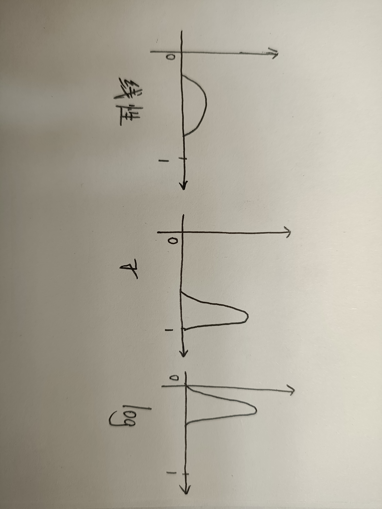

DIP小测

翁正朗 PB22000246

1. 本课程的主要学习内容有哪些?

    > 1. 图像变换
    > 2. 图像增强
    > 3. 图像修复
    > 4. 图像重建
    > 5. 图像压缩

2. 描述视觉现象中的同时对比度和马赫带现象。

    > 同时对比度指的是视觉系统对一个区域的颜色或亮度感知，会受到周围环境的影响。
    >
    > 
    >
    > 马赫带现象是视觉系统对强度变化边界的过度反应，表现为明暗交界处的高对比带。
    >
    > 假设一个渐变的灰色条带，它的颜色从左至右逐渐变浅。在这个渐变的边缘，视觉系统会增强边界的对比，使得灰色渐变区域的两侧出现明显的亮带和暗带。这些带的亮度并不实际存在，它们是由视觉处理机制造成的

3. 分别标注图像进行 DFT、DCT、Walsh 变换、Haar变换后的低频系数和高频系数分布。

    > | **变换类型** | **低频系数位置** | **高频系数位置**         | **适用场景**           |
    > | :----------- | :--------------- | :----------------------- | :--------------------- |
    > | **DFT**      | 频谱中心         | 频谱边缘                 | 频域滤波、全局分析     |
    > | **DCT**      | 左上角           | 右下角                   | JPEG压缩、块编码       |
    > | **Walsh**    | 左上角           | 右下角                   | 快速二值模式分析       |
    > | **Haar**     | LL子带（左上角） | LH/HL/HH子带（其他象限） | 多分辨率分析、图像压缩 |

4. 已知一幅图像的尺寸为 256\*256,现将其分成4\*4的小块，每一小块展开成 16维的矢量。请写出对这些矢量进行KL变换的过程。

    共得到$N=64\times64=4096$个16维向量
    $$
    x_i\in\mathbb{R}^{16\times1},i=1,...,	4096
    $$
    计算均值向量：
    $$
    \mu=\frac{1}{N}\sum_{i=1}^{N}x_i
    $$
    排列成矩阵，中心化：
    $$
    X_c=[x_1-\mu,...,x_N-\mu]\in\mathbb{R}^{16\times N}
    $$
    计算协差阵：
    $$
    C=E\{(x-\mu)(x-\mu)^T\}\\
    =\frac{1}{N}X_cX_c^T\in\mathbb{R}^{16\times 16}
    $$
    协差阵为对称阵，一定正交相似于对角阵，对角化：
    $$
    C=U\Lambda U^T,\text{orthogonal $U$}\\
    \Lambda=\mathrm{diag}(\lambda_1,...,\lambda_{16}),\lambda_1\geq...\geq\lambda_{16}
    $$
    U的每一列为特征向量。

    变换：
    $$
    Y=U^T(X-\mu\mathbf{1}_{1\times N})=U^TX_c
    $$
    将$Y$各列提取为向量，按由原图排列成向量的逆顺序恢复成矩阵，从而得到变换后的图片。

    

    若取前 $k$个最大特征值对应的特征向量（主成分），构成投影矩阵$U_k\in\mathbb{R}^{16\times 16}$，则变换为有损压缩。

5. 分别画出适合线性变换、log变换、伽玛变换(>1)的直方图分布

6. 写出对一幅图像进行直方图均衡化的过程

> 1. 统计原图像各灰度值下像素数量，计算PDF
> 2. 计算CDF
> 3. 将CDF的取值范围去归一化至原图像灰度值范围（如将概率[0,1]线性映射到灰度范围[0,255]）
> 4. 对去归一化后的CDF各台阶值四舍五入到整数得到新的CDF。从而由各台阶横坐标值到纵坐标值确定了灰度值的映射关系
> 5. 按照所得映射关系修改原图像，计算新图像的直方图。
>
> 其中3,4两步的计算可记为：
>
> 设原归一化CDF的各台阶值为$g_f$，新CDF（未归一化）的各台阶值为$g$，则：
> $$
> g=\mathrm{int}[(L-1)g_f+0.5]=\text{四舍五入}((L-1)g_f)
> $$
> 

7. 写出两种图像平滑的算法

> 频域低通滤波器
>
> 均值滤波

8. 写出两种图像锐化的算法

> 频域高通滤波器
>
> Laplace算子

9. 如何对一幅彩色图像进行直方图均衡?

> 将图片转为HSI色彩空间表达，对I亮度直方图作均衡化