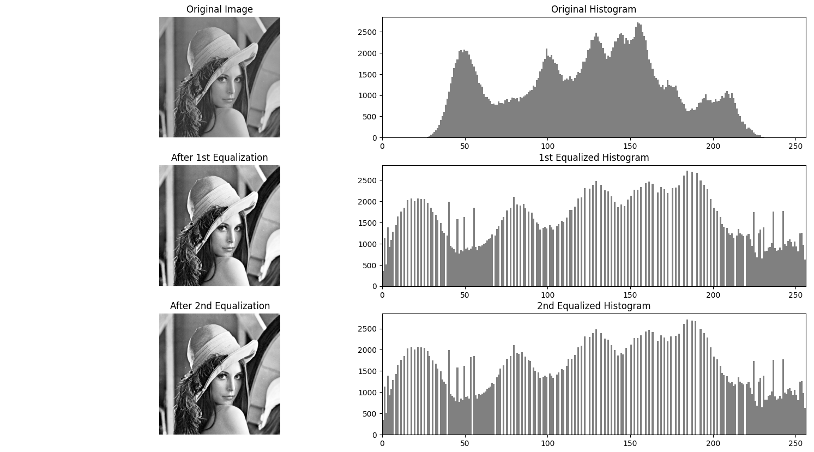
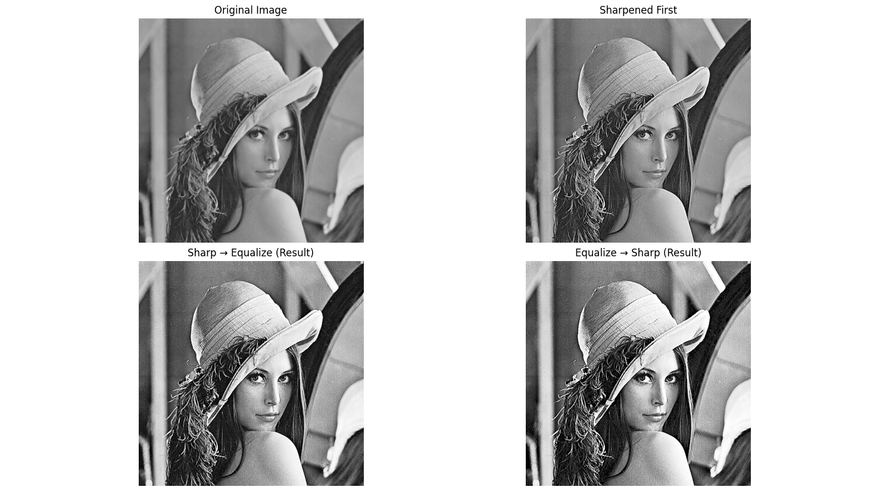
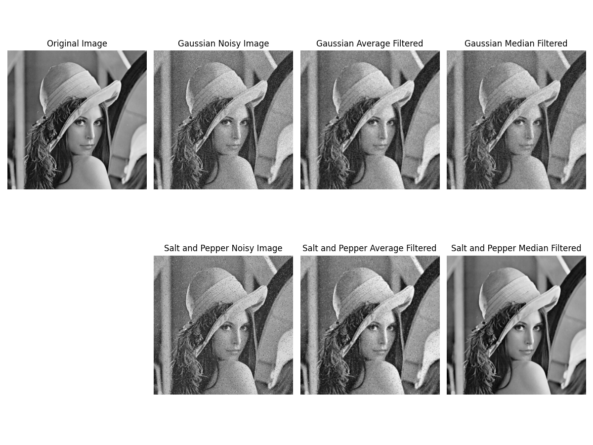

# DIP HW4

翁正朗 PB22000246 DIP 

## 1

为什么一般情况下对离散图象的直方图均衡并不能产生完全平坦的直方图？


HE可产生完全平坦的直方图是基于连续图像分析的结论。而数字图像像素数量离散（概率密度取值离散），灰度级离散。理论计算得到的输出灰度级可能不是可取的整数，导致需要对输出进行近似。

- **理论前提**：连续图像的均衡化可以通过概率积分变换实现完美的均匀分布。
- **离散问题**：数字图像的像素值只能是整数（如0-255），导致：
    - 多个输入灰度值可能被映射到同一个输出值
    - 某些输出灰度级可能没有对应的输入值


## 2

设已用直方图均衡化 (HE)技术对一幅图象进行了增强，试证明再用这个方法对所得结果增强并不会改变其结果。


由于一次HE后的灰度分布的PDF已经接近均匀，这意味着第二次均衡化后的累积分布函数CDF几乎是线性的。因为HE采用原图CDF作为变换函数，所以第二次的变换函数T也是线性的，对于每个灰度值的映射已经不再改变它的灰度值。Q.E.D.

理论情况下，直方图均衡化是一种幂等操作（idempotent），即多次应用与单次应用效果相同。

以下是两次直方图均衡化处理结果的对比，可见第二次处理后直方图几乎没有变化。



## 3

讨论用于空间滤波的平滑滤波器和锐化滤波器的相同点、不同点以及联系。

|      | 平滑滤波器                                         | 锐化滤波器                               |
| ---- | -------------------------------------------------- | ---------------------------------------- |
| 相同 | 都是空域滤波，使用卷积核对像素邻域加权计算得到结果 |                                          |
| 不同 | 平滑图像连续、缓慢变化部分，抑制高频               | 增强图像的边缘和跳变部分，增强高频       |
|      | 使用卷积核实现求和运算，卷积核各系数非负           | 使用卷积核实现差分运算，卷积核各系数可负 |
| 作用 | 去噪、图像平滑                                     | 边缘检测、细节增强                       |
| 缺点 | 可能丢失边缘信息                                   | 可能放大噪声                             |

## 4

有一种常用的图象增强技术是将高频增强和直方图均衡化结合起来以达到使边缘锐化的反差增强效果，以上两个操作的先后次序对增强结果有影响吗？为什么？


有影响。

1. 先高频增强 → 后直方图均衡化
    - 高频增强（如拉普拉斯锐化）会突出图像边缘和噪声，导致局部对比度剧烈变化。
    - 直方图均衡化随后对锐化后的图像进行全局灰度重新分配，可能进一步放大噪声或过度增强某些区域，导致不自然的视觉效果。
    - 适用场景：适合需要极端边缘强化的场景，但可能牺牲图像的自然性。

2.  先直方图均衡化 → 后高频增强
    - 直方图均衡化先扩展图像的整体动态范围，改善全局对比度
    - 高频增强再对均衡化后的图像操作，能更精准地锐化已有边缘，避免噪声被过度放大
    - 适用场景：适合大多数情况，尤其是噪声较多的图像，能平衡对比度提升与边缘增强。

以下是不同处理结果的对比：




## 5

编程实现对lena.bmp分别加入高斯噪声和椒盐噪声，再进行局域平均和中值滤波

代码：

```python
import cv2
import numpy as np
import matplotlib.pyplot as plt

# 读取 Lena 图像
image = cv2.imread('lena.bmp', cv2.IMREAD_GRAYSCALE)

# 高斯噪声的添加
def add_gaussian_noise(image, mean=0, sigma=25):
    row, col = image.shape
    gauss = np.random.normal(mean, sigma, (row, col))
    noisy = np.clip(image + gauss, 0, 255)  # 添加噪声并确保像素值在0到255之间
    #clip钳位操作，确保像素值在0到255之间
    return noisy.astype(np.uint8)

# 椒盐噪声的添加
def add_salt_and_pepper_noise(image, salt_prob=0.02, pepper_prob=0.02):
    noisy = image.copy()
    row, col = image.shape
    # 添加盐噪声
    salt = np.random.rand(row, col) < salt_prob
    noisy[salt] = 255  # 盐噪声将像素设为255
    # 添加胡椒噪声
    pepper = np.random.rand(row, col) < pepper_prob
    noisy[pepper] = 0  # 胡椒噪声将像素设为0
    return noisy

# 局域平均滤波
def local_average_filter(image, kernel_size=3):
    return cv2.blur(image, (kernel_size, kernel_size))

# 中值滤波
def median_filter(image, kernel_size=3):
    return cv2.medianBlur(image, kernel_size)

# 处理图像
# 1. 高斯噪声处理
gaussian_noisy = add_gaussian_noise(image)
gaussian_average_filtered = local_average_filter(gaussian_noisy)
gaussian_median_filtered = median_filter(gaussian_noisy)

# 2. 椒盐噪声处理
salt_and_pepper_noisy = add_salt_and_pepper_noise(image)
salt_and_pepper_average_filtered = local_average_filter(salt_and_pepper_noisy)
salt_and_pepper_median_filtered = median_filter(salt_and_pepper_noisy)

# 显示结果
fig, axs = plt.subplots(2, 4, figsize=(12, 9))

# 原图
axs[0, 0].imshow(image, cmap='gray')
axs[0, 0].set_title('Original Image')
axs[0, 0].axis('off')

# 高斯噪声
axs[0, 1].imshow(gaussian_noisy, cmap='gray')
axs[0, 1].set_title('Gaussian Noisy Image')
axs[0, 1].axis('off')

# 高斯噪声平均滤波
axs[0, 2].imshow(gaussian_average_filtered, cmap='gray')
axs[0, 2].set_title('Gaussian Average Filtered')
axs[0, 2].axis('off')

# 高斯噪声中值滤波
axs[0, 3].imshow(gaussian_median_filtered, cmap='gray')
axs[0, 3].set_title('Gaussian Median Filtered')
axs[0, 3].axis('off')


axs[1, 0].axis('off')

# 椒盐噪声
axs[1, 1].imshow(salt_and_pepper_noisy, cmap='gray')
axs[1, 1].set_title('Salt and Pepper Noisy Image')
axs[1, 1].axis('off')

# 椒盐噪声平均滤波
axs[1, 2].imshow(salt_and_pepper_average_filtered, cmap='gray')
axs[1, 2].set_title('Salt and Pepper Average Filtered')
axs[1, 2].axis('off')

# 椒盐噪声中值滤波
axs[1, 3].imshow(salt_and_pepper_median_filtered, cmap='gray')
axs[1, 3].set_title('Salt and Pepper Median Filtered')
axs[1, 3].axis('off')

plt.tight_layout()


# 保存图像为文件
plt.savefig('denoised_image_results.png')  # 保存为PNG文件，可以选择其他格式，如 .jpg, .pdf 等

plt.show()
```

运行结果：

