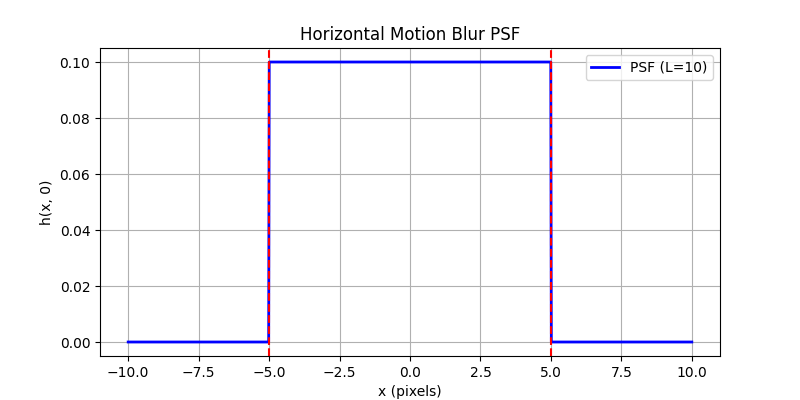
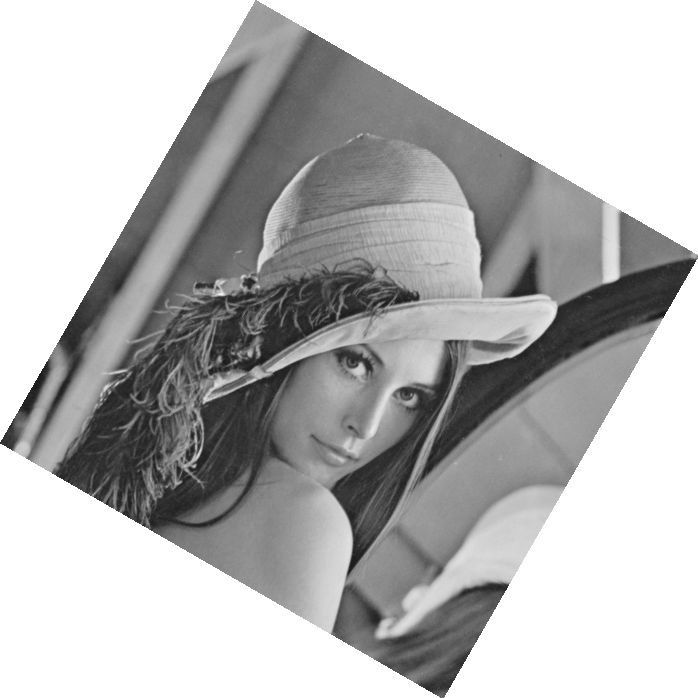

# DIP HW5

翁正朗 PB22000246 DIP 

## 1

写出逆滤波和维纳滤波图象恢复的具体步骤。


### 1. 逆滤波（Inverse Filtering）

#### 基本原理

通过逆转退化函数恢复图像，但对噪声敏感（尤其在频域零点附近）。

#### 具体步骤

已知模糊后图像$g(x,y)$，模糊系统的PSF：$h(x,y)$

1. **输入数据**  :
  - 退化图像 $g(x, y)$  
   - 点扩散函数（PSF） $h(x, y)$
2. **傅里叶变换**  
   $$
   G(u, v) = \mathcal{F}\{g(x, y)\}, \quad H(u, v) = \mathcal{F}\{h(x, y)\}
   $$

3. **设计逆滤波器**  
   $$
   \text{逆滤波器} = \frac{1}{H(u, v)}
   $$

4. **频域恢复（需处理零点问题）**  
   $$
   \hat{F}(u, v) = \begin{cases}
   \frac{G(u, v)}{H(u, v)} & \text{,if } |H(u, v)| \geq \text{threshold,} \\
   0 & \text{,else}
   \end{cases}
   $$

5. **逆傅里叶变换**  
   $$
   \hat{f}(x, y) = \mathcal{F}^{-1}\{\hat{F}(u, v)\}
   $$


### 2. 维纳滤波（Wiener Filtering）

#### 基本原理

最小均方误差（MMSE）优化，平衡去模糊与噪声抑制。

#### 具体步骤

1. **输入数据**  
   - 退化图像 $g(x, y)$  
   - PSF $h(x, y)$  
   - 噪声功率谱 $S_\eta(u, v)$ 和图像功率谱 $S_f(u, v)$（或常数比 $K$）

2. **傅里叶变换**  
   $$
   G(u, v) = \mathcal{F}\{g(x, y)\}, \quad H(u, v) = \mathcal{F}\{h(x, y)\}
   $$

3. **设计维纳滤波器**  
   $$
   W(u, v) = \frac{H^*(u, v)}{|H(u, v)|^2 + \frac{S_\eta(u, v)}{S_f(u, v)}}
   $$
   - 简化形式（当功率谱未知时）：
   $$
   W(u, v) = \frac{H^*(u, v)}{|H(u, v)|^2 + K}
   $$

4. **频域恢复**  
   $$
   \hat{F}(u, v) = W(u, v) \cdot G(u, v)
   $$

5. **逆傅里叶变换**  
   $$
   \hat{f}(x, y) = \mathcal{F}^{-1}\{\hat{F}(u, v)\}
   $$


### 对比

| **特性**       | **逆滤波**                  | **维纳滤波**                  |
|----------------|----------------------------|------------------------------|
| **噪声处理**   | 不抑制噪声，会放大         | 显式抑制噪声                 |
| **复杂度**     | 低（仅需PSF）              | 高（需噪声/图像功率谱）      |
| **适用场景**   | 噪声极小的理想情况         | 实际噪声环境                 |
| **恢复效果**   | 在 $H(u,v)$ 零点处失效     | 全局稳定                     |

## 2

推导水平匀速直线运动模糊的点扩展函数的数学公式并画出曲线。

所谓点扩展函数（PSF，Point Spread Function），实际上就是系统的单位冲击响应，即对于单位点冲击的响应。


### 1. 问题描述

假设相机在曝光时间 $T$ 内沿水平方向（$x$轴）以匀速 $v$ 运动，导致图像产生模糊。运动模糊的PSF $h(x,y)$ 描述理想点光源的模糊轨迹。

### 2. 数学推导

#### 运动参数

- 运动速度：$v$（像素/秒）
- 曝光时间：$T$（秒）
- 总模糊长度：$L = vT$（像素）

#### PSF定义

对于水平运动模糊，PSF仅在$x$方向有值：

$$
h(x,y) = 
\begin{cases} 
\frac{1}{L} & \text{if } |x| \leq \frac{L}{2} \text{ and } y = 0 \\
0 & \text{otherwise}
\end{cases}
$$

#### 归一化条件

满足能量守恒：
$$
\int_{-\infty}^{\infty} \int_{-\infty}^{\infty} h(x,y) \, dx dy = 1
$$

#### 连续域表达式

用矩形函数和狄拉克函数表示：
$$
h(x,y) = \frac{1}{L} \cdot \text{rect}\left(\frac{x}{L}\right) \cdot \delta(y)
$$

其中：
- $\text{rect}(x) = 
  \begin{cases} 
  1 & |x| \leq 0.5 \\
  0 & \text{otherwise}
  \end{cases}$
- $\delta(y)$ 是狄拉克delta函数

### 3. 曲线绘制（Python实现）

```python
import numpy as np
import matplotlib.pyplot as plt

L = 10  # 模糊长度
x = np.linspace(-L-5, L+5, 1000)
h = np.where(np.abs(x) <= L/2, 1/L, 0)

plt.figure(figsize=(10,4))
plt.plot(x, h, 'b-', linewidth=2)
plt.xlabel('x (pixels)'), plt.ylabel('h(x,0)')
plt.title(f'Horizontal Motion Blur PSF (L={L})')
plt.axvline(x=-L/2, color='r', linestyle='--')
plt.axvline(x=L/2, color='r', linestyle='--')
plt.grid(True)
plt.show()
```





## 3

编程实现lema.bmp的任意角旋


```python
import numpy as np
import cv2
import math

def manual_rotate(image, angle_deg, background_color=(0, 0, 0)):
    """
    手动实现图像任意角度旋转
    :param image: 输入图像(BGR格式)
    :param angle_deg: 旋转角度(顺时针为正，单位：度)
    :param background_color: 填充背景颜色(BGR元组)
    :return: 旋转后的图像
    """
    # 转换为弧度
    angle_rad = math.radians(angle_deg)
    cos_a = math.cos(angle_rad)
    sin_a = math.sin(angle_rad)
    
    # 获取图像尺寸
    h, w = image.shape[:2]
    
    # 计算新图像尺寸
    new_w = int(abs(w * cos_a)) + int(abs(h * sin_a))
    new_h = int(abs(h * cos_a)) + int(abs(w * sin_a))
    
    # 创建新图像
    rotated = np.full((new_h, new_w, 3), background_color, dtype=np.uint8)
    
    # 计算中心点偏移
    cx = w / 2
    cy = h / 2
    new_cx = new_w / 2
    new_cy = new_h / 2
    
    # 逆向映射：遍历新图像的每个像素
    for y in range(new_h):
        for x in range(new_w):
            # 计算相对于新图像中心的坐标
            x_rel = x - new_cx
            y_rel = y - new_cy
            
            # 应用逆向旋转变换
            #计算原像素的理论位置
            src_x = x_rel * cos_a + y_rel * sin_a + cx
            src_y = -x_rel * sin_a + y_rel * cos_a + cy
            
            # 双线性插值
            if 0 <= src_x < w and 0 <= src_y < h:
                x1, y1 = int(src_x), int(src_y) #取整计算原像素理论位置最临近的4个像素位置
                x2, y2 = min(x1 + 1, w - 1), min(y1 + 1, h - 1)
                
                # 计算权重
                dx = src_x - x1
                dy = src_y - y1
                
                # 四个相邻像素
                p11 = image[y1, x1]
                p21 = image[y1, x2]
                p12 = image[y2, x1]
                p22 = image[y2, x2]
                
                # 双线性插值计算
                rotated[y,x]= (
                    p11 * (1 - dx) * (1 - dy) +
                    p21 * dx * (1 - dy) +
                    p12 * (1 - dx) * dy +
                    p22 * dx * dy
                )
    
    return rotated

# 读取图像
image = cv2.imread('..\lena.bmp')
if image is None:
    raise FileNotFoundError("无法加载图像，请检查路径")

# 设置旋转角度(示例：30度)
angle = 30

# 执行旋转
rotated_image = manual_rotate(image, angle, background_color=(255, 255, 255))

# 显示结果
cv2.imshow('Original', image)
cv2.imshow(f'Rotated {angle} degrees (Manual)', rotated_image)
cv2.waitKey(0)
cv2.destroyAllWindows()

# 保存结果
cv2.imwrite('rotated_lema_manual.bmp', rotated_image)
```


