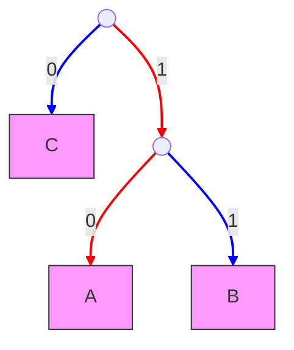
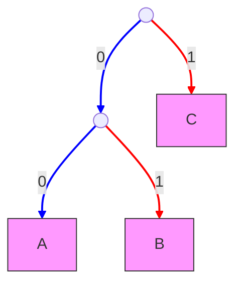

# DIP HW7

翁正朗 PB22000246 

5月26日

## 1

1. 请说明是否能用变长变码法压缩一幅已直方图均衡化的具有$2^n$级灰度的图？
2. 这样的图像中包含像素间冗余吗？

**解：**

1. **不能显著压缩**

理想情况下，直方图均衡化后每个灰度级的概率分布为均匀分布，即$p_i = \frac{1}{2^n},i=\{0,1,...,2^n-1\}$

此时，信息熵$H = -\sum_i p_i \log p_i = n(\rm bit)$。采用等长n比特编码和最优变长编码的平均编码长度都是n比特，采用变长编码无法压缩。

考虑到由于灰度级离散，实际直方图均衡化后灰度级PDF不完全为均匀分布，即$p_i \approx \frac{1}{2^n},i=\{0,1,...,2^n-1\}$

此时，信息熵$H = -\sum_i p_i \log p_i \approx n(\rm bit)$。采用变长编码无法显著压缩图像

2. **不包含典型的像素间冗余**，原因包括：
    1. **均衡化对冗余的消除**：
       - 直方图均衡化通过灰度级重新分配，破坏了原始的空间相关性
       - 像素值趋向于统计独立（理想情况下）
    2. **灰度级特性**：
       - $2^n$级灰度保证了无量化冗余
       - 均衡化后相邻像素的灰度值差异增大，降低了预测编码效率
    3. **特殊情况说明**：
        - 若原图存在结构性纹理（如周期性图案），可能残留少量空间冗余
        - 但严格意义上的直方图均衡化会最大限度消除这类冗余
    
    

若需进一步压缩此类图像，应考虑：
1. **有损压缩**：如JPEG的DCT变换
2. **空间域方法**：基于边缘/纹理特征的编码
3. **深度学习**：Autoencoder等非线性变换方法

（注：实际应用中，因均衡化不完全理想，可能仍存在微量冗余，但理论分析通常按理想情况处理）

## 2

1. 对一个具有3个符号的信源，有多少唯一的Huffman码？

2. 构造这些码

**解：**

设信源有3个符号$A,B,C$，不妨设$P(A)\leq P(B)\leq P(C)$

显然首先将$A,B$作为左右子树合成新节点。

接下来分两种情况：

1. $P(A) + P(B)\geq P(C)$
    - 则$C$作为根节点左子树，合成节点作为右子树，如图1
    - $A,B,C$编码为$10,11,0$
2. $P(A) + P(B)\leq P(C)$
    - 则$C$作为根节点右子树，合成节点作为左子树，如图2
    - $A,B,C$编码为$00,01,1$

## 3

已知符号a,e,i,o,u,?的出现概率分别是0.2，0.3，0.1，0.2，0.1，0.1，对0.23355进行解码，解码长度为6。

**解：**进行算术编码解码：

| Symbol | Step 0 (初始) | Step 1 (e) | Step 2 (a) | Step 3 (i) | Step 4 (i)  | Step 5 (?)   | Step 6 (a) |
| ------ | ------------- | ---------- | ---------- | ---------- | ----------- | ------------ | ---------- |
| `?`    | 1.0           | 0.5        | 0.26       | 0.2360     | **0.2336**  | 0.2336       |            |
| `u`    | 0.9           | 0.47       | 0.254      | 0.2354     | **0.23354** | 0.233594     |            |
| `o`    | 0.8           | 0.44       | 0.248      | 0.2348     | 0.23348     | 0.233588     |            |
| `i`    | 0.6           | 0.38       | **0.236**  | **0.2336** | 0.23336     | 0.233576     |            |
| `e`    | **0.5**       | 0.32       | **0.230**  | **0.2330** | 0.23330     | 0.233570     |            |
| `a`    | **0.2**       | **0.26**   | 0.212      | 0.2312     | 0.23312     | **0.233552** |            |
|        | 0.0           | **0.2**    | 0.2        | 0.230      | 0.2330      | **0.23354**  |            |

其中每个符号右边的分割值为该符号对应区间的上限

解码结果为：**eaii?a**